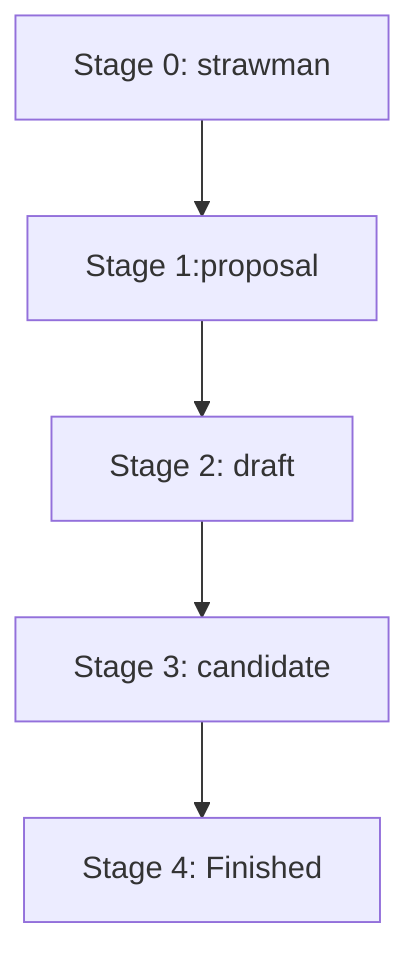

# History and Evolution
### How Js was created
JavaScript was created in May 1995 in **10 days** by Brendan Eich ant Netscape, and implemented Js for their web browser, Netscape Navigator.

### Main Idea
The idea was that major interactive parts of the client-side web were to be implemented in Java. 

>In Netscape Navigator 2.0 beta 3 (December 1995), it got its final name, JavaScript.

## Standardizing JavaScript
1. ECMA-262 is hosted by Ecma International (primary standard).
2. ISO/IEC 16262 is hosted by International Organization for Standardization (ISO).

## Note
The language described by these standards is called *ECMAScript*, not JavaScript.
1. The term JavaScript refers to the language ans its implementation.
2. The term ECMAScript refers to the language standard and language versions.

## Ecma Technical Committee 39 (TC39)
TC39 is the committee that evolves JavaScript.
### TC39 Process
1. ECMAScript features are designed independently and go through stages, starting at 0 (strawman), ending at 4 (finished).
2. The later stage require prototype implementations and real-world testing.
3. ECMAScript Versions are released once per year and include all features that have reached stage 4 prior to a release deadline.




- Stage 0: Sketch
- Stage 1: TC39 Helps
- Stage 2: Likely to be standardized
- Stage 3: Done, needs feedback from implementations
- Stage 4: Ready for standardization 
## Downsides
- JavaScript engines become bloated (they need to support both, old and the new version)
- Programmers must be conscious of differences between versions.
- We can migrates all oof an existing code base to the new version, or we can mix versions and refactoring becomes harder.
## One JavaScript
- New versions are always completely backward compatible.
- Old features are not removed or fixed.
- If aspects of the language is changed, it is done inside new syntactic constructs.
## New JavaScript Features
### ECMAScript 2022
#### New Member of clases
1. Properties slots created via
	1. Instance public fields
	2. Static public fields
2. Private slots are new and can be created via
	1. Private fields
	2. Private methods and accessors
3. Static initialization blocks

*Private slots checks:* Ergonomic brand checks for private fields.
*Top-level await in modules:* We can now use await at the top levels if modules and do not have to enter sync functions or methods anymore.
```error.cause:``` Error and its subclasses now let us specify which error caused the current one.
*Method . at() of indexable values:* Let us read an element at a given index like the bracket operator and supports negative indices.
*RegExp math indices:* If we add a flag to a regular expression, using it produces match objects that record the start and end index of each group capture.
```Object.hasOwn(obj, propKey):``` Provides a safe way to check if an object has an own property with the key propKey.